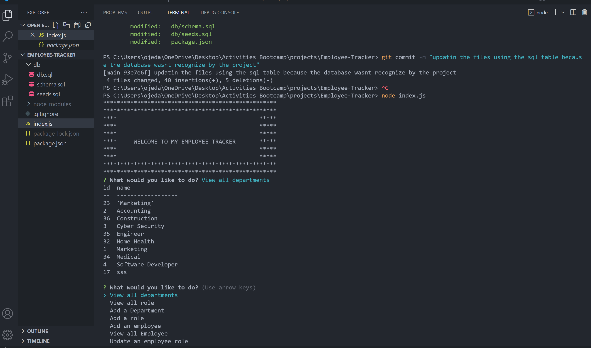

# EMPLOYEE TRACKER 

## Table of Contents
- [Description](#description)
- [Installation](#installation)
- [Usage](#usage)
- [Contribution](#contribution)
- [Testing](#testing)
- [Screenshot](#screenshot)

## Description:
Project based on creating an employee tracker in which its going to do the work more reliable and simple for those companies who want to acquire this system for a better performance for their databases.

## Installation:
We are going to used npm install in the terminal  to install all the packages needed.

## Usage:
We used the project by cloning the repo and and start the project by installing the dependencies using npm i, and then your going to go to the terminal and do a npm start to view the database from MySQL and run mysql -u root -p

## License:
This license is public used you can find it on:
https://opensource.org/licenses/MIT

## Contribution:
Yes you can contribute to the project by sending me  an email.

## Testing:
You can test the project by cloning the repository and start the project by installing the dependencies using npm i, and the next step your going to go the terminal and type node index.js to run the app

## Screenshot:

#### Walkthrough [Video](https://drive.google.com/file/d/1rTwjEqiO3Z0LM51CrR4Y-ZBFpGXZRjrN/view)

## Contact Information:
- Github: https://github.com/wilmerojeda13.
- Email: ojedawilmerantonio@gmail.com. 